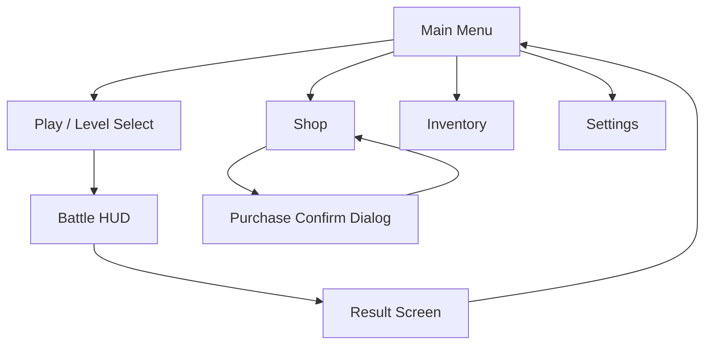

# Skill: UI Wireframe & User Flow

## When to use this skill
- User asks to design a screen layout or UI structure
- User needs a user flow or navigation map
- User says "how should this screen look?" or "map out the menu flow"

## Step-by-Step Execution

### Step 1 — Screen Inventory
List all screens needed:

```markdown
## Screen Map
1. Main Menu
2. Shop
3. Inventory
4. Battle HUD
5. Settings
6. ...
```

### Step 2 — Navigation Flow (Mermaid)
Always output a Mermaid flowchart showing screen connections:



### Step 3 — Wireframe Description (Per Screen)
For each screen, describe the layout using structured text with spatial positioning:

```markdown
## Screen: [Screen Name]

### Layout (top → bottom)

┌────────────────────────────────┐
│ STATUS BAR (SafeArea top)       │
├────────────────────────────────┤
│ HEADER                          │
│ [← Back]  [Screen Title]  [⚙] │
├────────────────────────────────┤
│ CONTENT AREA                    │
│                                 │
│  ┌──────┐ ┌──────┐ ┌──────┐   │
│  │ Card │ │ Card │ │ Card │   │
│  │  01  │ │  02  │ │  03  │   │
│  └──────┘ └──────┘ └──────┘   │
│                                 │
│  ┌──────┐ ┌──────┐ ┌──────┐   │
│  │ Card │ │ Card │ │ Card │   │
│  │  04  │ │  05  │ │  06  │   │
│  └──────┘ └──────┘ └──────┘   │
│                                 │
├────────────────────────────────┤
│ BOTTOM NAV                      │
│ [🏠Home] [⚔Battle] [🎒Bag] [👤Profile] │
└────────────────────────────────┘
```

### Step 4 — Interaction Annotation
For each interactive element, document:

| Element | Tap Action | Long Press | Swipe |
|---|---|---|---|
| Card 01 | Open detail modal | Show tooltip | — |
| Back button | Navigate to previous screen | — | — |
| Bottom Nav tab | Switch tab + highlight | — | Swipe between tabs |

### Step 5 — Screen State Matrix
Define what happens in each state:

| State | Visual Behavior |
|---|---|
| **Loaded** | Show cards in grid |
| **Empty** | Center message "No items yet" + CTA button |
| **Loading** | Skeleton placeholders (shimmer animation) |
| **Error** | Error message + retry button |

## Best Practices
- Keep wireframes low-fidelity — NO colors, NO icons, just layout boxes and labels
- Every screen must have a clear primary action (one dominant CTA)
- Navigation flow must satisfy the "3-tap rule" from `2d-01-ux-principles`
