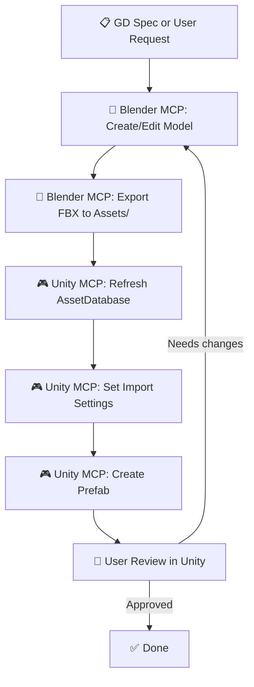

# Skill: Blender-to-Unity Pipeline

## When to use this skill
- User has finished a model in Blender and needs it in Unity
- User asks about FBX export/import best practices
- User wants to automate the full pipeline via MCP

## Step-by-Step Execution

### Step 1 — Pre-export Checklist (Blender)

- [ ] All transforms applied (`Ctrl+A` → All Transforms)
- [ ] Origin at correct position (feet for characters, center for props)
- [ ] Scale: 1 unit = 1 meter
- [ ] No hidden objects included in export
- [ ] Materials named per convention (`mat_[name]_[part]`)
- [ ] UV Channel 0: Clean texture UVs
- [ ] UV Channel 1 (if baked lighting): Non-overlapping lightmap UVs
- [ ] Armature: Leaf bones removed, only deform bones exported
- [ ] Animations: All clips baked (no IK constraints in export)

### Step 2 — FBX Export Settings

```
Path Convention: Export to Unity project directly
  → Assets/Art/[Category]/[name].fbx

FBX Settings:
  Scale: 1.0, Apply Unit: ✅
  Forward: -Z, Up: Y
  Apply Transform: ✅
  
Object Types: ✅ Mesh, ✅ Armature, ❌ Camera, ❌ Light, ❌ Empty
  
Mesh:
  ✅ Apply Modifiers
  ✅ Tangent Space (needed for normal maps)
  ❌ Loose Edges
  
Armature:
  ✅ Only Deform Bones
  ❌ Add Leaf Bones
  
Animation:
  ✅ Bake Animation
  ✅ NLA Strips (if using NLA)
  Key Reduction: 0.1
```

### Step 3 — Unity Import Settings

**Model Tab:**
```
Scale Factor: 1
Mesh Compression: Medium (or Off for hero assets)
Read/Write: ❌ (disable to save runtime memory, unless needed for scripts)
Normals: Import
Tangents: Calculate Mikktspace
```

**Rig Tab:**
```
Animation Type: Humanoid (retargetable) / Generic (custom rig)
Avatar Definition: Create From This Model
```

**Animation Tab (per clip):**
```
Loop Time: ✅ (for idle, walk, run) / ❌ (for attack, death)
Root Transform Rotation: Bake Into Pose ✅
Root Transform Position (Y): Bake Into Pose ✅ (feet grounded)
Root Transform Position (XZ): Based on Root Node / Bake ✅
Curves: Add events at impact frames
```

**Materials Tab:**
```
Material Creation Mode: None (assign manually for control)
  → Or: Import Materials for quick setup
Remap Materials: Assign project materials after first import
```

### Step 4 — Post-import Setup

```
1. Assign correct materials (URP or Built-in)
2. Configure LOD Group component (if LODs exported)
3. Set up colliders (Mesh Collider for complex, Box/Capsule for simple)
4. Create Prefab from imported model
5. Add to Addressable group if applicable
6. Test in scene: position, scale, materials, animations
```

### Step 5 — Cross-MCP Automation (Full Pipeline)



### Step 6 — Import Report

```markdown
## Import Report: [Model Name]

| Field | Value |
|---|---|
| Source | [Blender file path] |
| Exported FBX | [Unity asset path] |
| Triangles | [count] |
| Materials | [list] |
| Bones | [count or N/A] |
| Animation Clips | [list or N/A] |
| LOD Levels | [count or N/A] |
| Texture Maps | [list with resolutions] |
| Prefab Created | [Yes/No — path] |

### Warnings
- [Any issues during import]
```

## Best Practices
- **Never** modify the FBX inside Unity's Assets folder with external tools while Unity is open (meta file corruption)
- Keep Blender source file (`.blend`) in a `SourceAssets/` folder outside Unity's `Assets/` directory
- If re-exporting: overwrite the same FBX path to preserve Unity references (meta GUID stays)
- Always verify Animation Events survived the reimport
