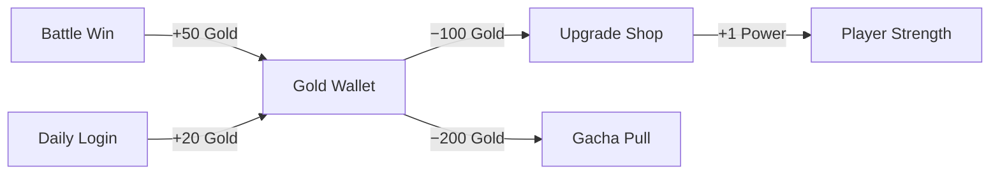

# Skill: Economy System Design

## When to use this skill
- User asks to design a currency system, shop, or resource flow
- User mentions gacha, lootbox, drop rates, or crafting costs
- User needs to audit an existing economy for inflation or deflation

## Decision Tree

| Request | Action |
|---|---|
| "Design a currency system" | Map all currencies → define sources/sinks → set exchange rates |
| "Design a shop" | Categorize items → set pricing tiers → design refresh mechanics |
| "Design gacha/lootbox" | Define rarity tiers → set odds → design pity system → check legal compliance |
| "Economy feels broken" | Audit 4 pillars → find missing sink/source → rebalance |

## Step-by-Step Execution

### Step 1 — Currency Architecture
Define every currency in the game:

```
CURRENCY: [Name]
TYPE: [Soft / Hard / Event / Social]
SOURCE: [How player earns it — list all methods]
SINK: [How player spends it — list all methods]
CAP: [Max holdable? Overflow behavior?]
CONVERT: [Can convert to/from other currencies? Rate?]
PREMIUM: [Purchasable with real money? Y/N]
```

### Step 2 — Economy Flow Diagram
Always output a Mermaid flow diagram showing resource circulation:


### Step 3 — Inflation Control
For every source, define a corresponding sink. If source > sink, the economy inflates and rewards feel worthless. Include:
- Daily earning cap
- Increasing upgrade costs (exponential curve)
- Consumable items that are destroyed on use

## Best Practices
- Hard currency (Gems) should have 70% IAP source, 30% free source
- Soft currency (Gold) should be earnable freely but never enough to skip progression
- Always design a **pity system** for gacha (guaranteed reward after N pulls)
- Show drop rates transparently (legal requirement in many countries)
